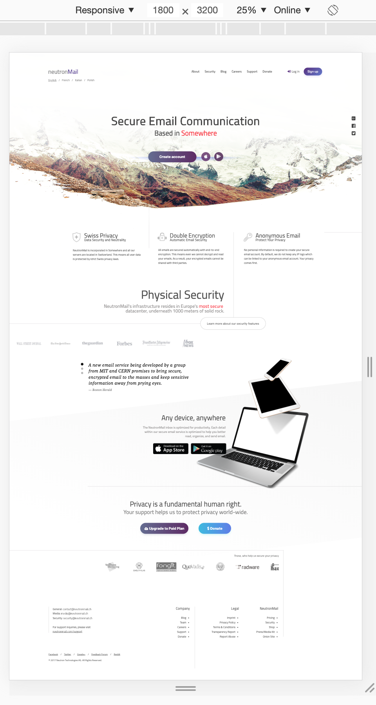

# NeutronMail

The web page was created according to: 
**[NeutronMail PSD](https://www.dropbox.com/s/t100g6172y0yxv1/neutronmail.psd?dl=0)**

**Details:**

* Made with HTML and CSS (using flex & grid)
* Responsive
* Browser Support: *Latest* Google Chrome, Mozilla Firefox, Microsoft Edge

**The below pic is how the desktop version looks like in browser**

[You can click here to open and see the page](https://yuliabeliak.github.io/Mail/)

